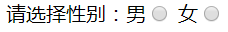

## HTML核心知识点

### 表单相关标签 ★★★★★

*题外话：表单标签在整个JavaWeb开发中都占据了十分重要的地位，仅仅拿在黑马培训举例，表单标签的应用贯穿了整个培训阶段，只要做项目就离不开此标签，因此这块内容必须掌握*

#### form表单标签

* 写法：\<form\>\</form\>


* 作用：是为了将用户通过浏览器输入的数据提交到服务器。
* \<form\>标签所包含的重点属性：action、method、enctype
  * action：指定数据需要提交到的服务器路径
  * method：指定数据提交的方式，有GET与POST 两种提交方式
  * enctype：一般在做文件上传的时候用，设置enctype=“multipart/form-data”即可
* 如何做到表单的提交的？通过在form标签下设置表单相关标签的name属性，再通过用户输入或者选择自动的给标签设置value属性，在用户点击提交按钮或者用ajax的方式提交数据时，将数据以key=value&key=value...的形式传到服务器端。

#### input标签

* 写法：\<input\>\</input\>
* 作用：为用户提供输入数据的空间。
* 所包含的重点属性：type、name、value
  * name属性：元素名，如果需要表单数据提交到服务器，必须提供name属性值，服务器通过属性值获得提交的数据。
  * value属性：设置input标签的默认值。若为输入框，那么当数据提交时value对应用户输入的内容。
  * type属性中包含8种重要属性值
    * text：文本框，单行的输入字段，用户可在其中输入文本。若在input标签中不设置type属性，那么默认的type属性即为text。
    * password：密码框，密码字段。用户输入的数据以黑圆表示。
    * radio：单选框，表示一组互斥选项按钮中的一个。当一个按钮被选中，之前选中的按钮就变为非选中的。
    * checkbox：复选框，用户可以一次选择多个。
    * submit：提交按钮。点击此按钮就会把表单数据发送到服务器。
    * button：普通按钮，经常与JavaScript结合使用。
    * file：文件上传组件，提供“浏览”按下可以选择需要上传的文件。
    * hidden：隐藏字段，数据会发送给服务器，但浏览器不进行显示。

#### input标签重点属性详解

##### name属性

* name属性可以说是表单提交中一个最最重点属性了，看上文可知，若要做到数据的提交，需要给表单相关标签设置name属性才行，那么，若是不设置呢？不设置的情况下，就算用户已经输入了数据，该数据也提交不到后台，造成用户录入数据丢失。

  ```html
  错误示例：
  <input />
  正确示例：
  <input name="username" />
  当这种状况下在用户输入数据后(假设输入的是zs)数据才能以username=zs的形式传递到后台服务器
  ```

* **强烈建议：** 平常写表单的时候除了submit提交按钮，在写其他表单标签的时候务必加上name属性！！！

##### value属性

* 对于type=“text”或者type=“password”，用户输入的数据即为value属性所对应的值，若显示的指定value值，例如` <input name="username" value="zs" />` ，那么输入框会有一个默认值为zs，当用户什么都不输入的情况下会将username=zs提交到后台，对于type=“button”，或者type="submit"，设置value的值，为按钮上面展示的文字。

##### type属性

###### type="radio",单选按钮

* 如何设置才能保证单选呢？拿性别举例，需要设置两个单选按钮，一个表示男，一个表示女，来做到单选的效果，如图：

  ```HTML
  正确设置示例：
  男<input type="radio" name="sex" value="male" />
  女<input type="radio" name="sex" value="female" />
  错误设置示例1：
  男<input type="radio" name="male" />
  女<input type="radio" name="female" />
  错误设置示例2：
  男<input type="radio" name="sex" />
  女<input type="radio" name="sex" />
  ```

  * 单选按钮设置中，name代表单选按钮所属类别，比如男、女均属于性别，那个name="sex"。
  * 单选按钮设置中，value代表当前单选按钮选中后，对应提交的值，此处即设置value="male"或者value="female"。
  * 若将name属性设置为不同数据，即错误示例1的情况，会造成可以同时选择男、女两个按钮的状况，起不到单选的作用
  * 若name设置正确，但是不设置value值，那么value的默认值即为on，也就是说，在提交数据时，无论选择男或者女提交，都会以sex=on的形式将数据提交上去，无论选男还是选女提交的数据都是一样的，那么数据的提交也就失去了意义。
  * 可在该标签设置checked="checked"属性，则该单选框将处于默认勾选状态。

###### type="checkbox",多选按钮

```HTML
请选择爱好：
篮球<input type="checkbox" name="hobby" value="lanqiu" />
足球<input type="checkbox" name="hobby" value="zuqiu" />
排球<input type="checkbox" name="hobby" value="paiqiu" />
```

* 多选按钮设置中，name代表单选按钮所属类别，比如篮球、足球、排球均属于爱好，那个name="hobby"。
* 多选按钮设置中，value代表当前多选按钮选中后，对应提交的值，若用户勾选三个全部勾选上了，那么数据就会以hobby=lanqiu&hobby=zuqiu&hobby=paiqiu 的形式提交。后台可以对key为hobby的数据以数组的形式接收。
* 若将name属性设置为不同数据，那么提交的时候数据就不会从属于一个数组。
* 若未设置value值，那么默认值也为on，就会以hobby=on&hobby=on&hobby=on的形式提交，提交的数据也就失去了意义。
* 可在该标签设置checked="checked"属性，则该多选框将处于默认勾选状态。

###### type="hidden"，隐藏域

* 应用场景即为某条数据不需要给用户展示，但是后台需要用到这条数据作逻辑处理
  * 场景一：需要从前台传递一个方法的名称到后台以便调用对应的方法；
  * 场景二：需要从前台传递一个商品的id值到后台以便后台根据商品id查询出有关该商品的详细信息。

#### select下拉列表标签

* 写法

  ```html
  <select name="city">
  	<option value="0">北京</option>
  	<option vlaue="1">上海</option>
  </select>
  ```

* name属性：发送给服务器的名称

* multiple属性：不写默认单选，取值为“multiple”表示多选

* \<option\>子标签：下拉列表中的一个选项(一个条目)。

  * selected : 勾选当前列表项
  * value：发送给服务器的选项值

* 该标签特殊的一点是在提交数据时，name为select标签中设置的name值，value为用户选中的对应的option标签中设置的value值(若未给option标签设置value属性,那么value值默认为当前option标签下的文本值，例如北京)。

#### textarea文本域标签

* \<textarea\>文本域。多行的文本输入控件
  * cols属性：文本域的列数
  * rows属性：文本域的行数
  * 注意：给文本域标签设置默认值的方式：` <textarea name="beizhu">hello</textarea>` hello即为默认值。

###div标签★★★★

* 写法` <div></div>`
* div标签就是HTML一个普通标签，进行区域划分。
* 特性：独占一行。
* 通常用id或class来标签div标签，再结合CSS样式渲染来实现各种效果，当前流行框架如bootstrap、easyUI均采用div标签作为基础标签来实现各种各样的效果。

### 表格标签★★★★

HTML表格由\<table\>标签以及一个或多个\<tr\>、\<th\>或\<td\>标签组成。

#### table标签

* table是父标签，相当于整个表格的容器。


* border 表格边框的宽度。
* width 表格的宽度。
* cellpadding 单元边沿与其内容之间的空白。
* cellspacing单元格之间的空白。
* bgcolor表格的背景颜色。

#### tr标签

* tr标签用于定义行

#### td标签

* td标签用于定义表格的单元格（一个列）


* colspan 单元格可横跨的列数
* rowspan 单元格可横跨的行数
* align 单元格内容的水平对齐方式，取值：left 左、right 右、center 居中。
* nowrap 单元格中的内容是否折行

#### \<th\>标签用于定义表头。单元格内的内容默认居中、加粗

```html
<table border="1" width="400px" cellpadding="0" cellspacing="0">
  <tr>
    <th>1标题</th>
    <th>2标题</th>
    <th>3标题</th>
  </tr>
  <tr>
  	<td>1</td>
    <td>2</td>
    <td>3</td>
  </tr>
```

### 超链接标签a标签★★★★

\<a\>标签是超链接标签，是在HTML页面提供的一种可以访问其他位置的实现方式。

* href：用于确定需要显示页面的路径(URL)
* target:确定以何种方式打开href所设置的页面。常用取值：\_blank、\_self等
  * _blank 在新窗口中打开href确定的页面。
  * _self 默认。使用href确定的页面替换当前页面。

### 图片标签\

\在HTML页面中引用一张图片

* src:指定需要显示图片的URL(路径)  **(必须掌握)**。
* alt：图片无法显示时的替代文本。
* width：设置图像的宽度。
* height：定义图像的高度。

## CSS核心知识点

### CSS样式规则

* 具体格式

  ```
  选择器{
    属性1:属性值;
    属性2:属性值;
    ...
  }
  ```

* 具体示例

  ```css
  <style>
    h2{
      color:red;
      font-size:100px;
    }
  </style>
  ```

* 注意事项

  * CSS样式"选择器"严格区分大小写，"属性"和"属性值"不区分大小写。
  * 多个属性之间必须用英文状态下的分号隔开，最后一个属性后的分好可以省略，但是，为了便于增加新样式最好保留。
  * 如果属性的值由多个单词组成且中间包含空格，则必须为这个属性值加上英文状态下的引号。

### 引入CSS样式★★★

* 行内样式

  ```html
  <a style="color:#f00;font-size:30px;">传智播客</a>
  ```

  * 通过在标签内部的style属性来设置元素的样式。
  * 行内样式通过标签的属性来控制样式，这样并没有做到结构与表现(HTML展示结构、CSS显示效果)相分离，所以一般很少使用。不推荐。

* 内部样式

  ```css
  <style type="text/css">
    body{
      background-color:#ddd;
    }
  </style>
  ```

  * 内嵌式CSS样式只对其所在的HTML页面有效，对其他页面无效，因此他不能充分发挥CSS代码的重用优势。

* 外部样式

  ```css
  <link rel="stylesheet" type="text/css" href="css/demo00.css" />
  ```

### 选择器

* 元素选择器

  * 即用标签名如a、div、table、h1等做选择器

    ```css
    h1{
      color:#F00;
      font-size:50px
    }
    ```

* id选择器

  * 给标签设置id后用#id的方式选择标签

    ```css
    #demo1{
      color:#0f0;
    }
    <h1 id="demo1">黑马训练营</h1>
    ```

* 类选择器

  * 给标签设置class后用.class的方式选择标签

    ```css
    .myClass{
      font-size:25px;
    }
    <h1 class="myClass">Java 培训</h1>
    ```
### 转换：display
HTML 提供丰富的标签，这些标签被定义成了不同的类型，一般分为：块标签和行内标签。
* 块标签：以区域块方式出现。每个块标签独自占据一整行或多整行。
    * 常见的块元素：\<h1\>、\<div\>、\<ul\>等
* 行内元素：不必在新的一行开始，同时也不强迫其他元素在新的一行显示。
    * 常见的行内元素:\<span\>、\<a\>等。
* 常见属性值：
    * inline：此元素将显示为行内元素(行内元素默认的display属性值)
    * block：此元素将显示块元素(块元素默认的display属性值)
    * none：此元素将被隐藏，不显示，也不占用页面空间​
