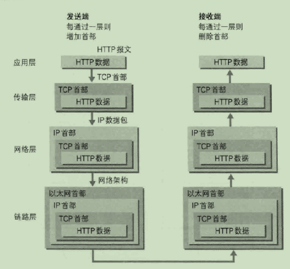

### 给初学者的建议

* HTTP协议内容是有很多的，课堂上为了课程的推进将部分核心知识点说了一下，课堂上教授的那些也是对以后学习的过程中影响较深的，建议务必掌握好，另外若是以后有时间的话还是花点时间在HTTP协议上多看一些知识点，毕竟做JavaWeb开发若是对HTTP协议只了解一点皮毛的话是远远不够的。因此本文从HTTP权威指南一书中又摘抄了一些核心知识点。

### 协议分层及基本流程★★★

- 我们用HTTP举例来说明，首先作为发送端的客户端在应用层（HTTP协议）发出一个想看某个Web页面的HTTP请求。
- 接着，为了传输方便，在传输层（TCP协议）把从应用层处收到的数据（HTTP请求报文）进行分割，并在各个报文上打上标记序号及端口号后转发给网络层。
- 在网络层（IP协议），增加作为通信目的地的MAC地址后转发给链路层。这样一来，发往网络的通信请求就准备齐全了。
- 接收端的服务器在链路层接收到数据，按序往上层发送，一直到应用层。当传输到应用层，才能算真正接收到由客户端发送过来的HTTP请求。

### 四层协议关系图★★★★★

步骤如下：

1. 浏览器从URL中解析出服务器的主机名；
2. 浏览器将服务器的主机名转换成服务器的IP地址；
3. 浏览器将端口号(如果有的话)从URL中解析出来；
4. 浏览器建立一条与Web服务器的TCP连接；
5. 浏览器向服务器发送一条HTTP请求报文；
6. 服务器向浏览器回送一条HTTP响应报文；
7. 关闭连接，浏览器显示文档。

### 负责传输的IP协议★★★

- IP协议位于网络层。IP不等同于IP地址，它其实是一种协议的名称。
- IP协议的作用是把各种数据包传送给对方。保证确实传送到对方的两个需要满足的重要条件是IP地址和MAC地址。
- IP地址指明了节点被分配到的地址，MAC地址是指网卡所属的固定地址。IP地址可以和MAC地址进行配对。IP地址可变换，但MAC地址基本上不会更改。

### 确保可靠的TCP协议★★★

- 按层次分，TCP位于传输层，提供可靠的字节流服务。
  - 字节流服务是指，为了方便传输，将大块数据分割成以报文段为单位的数据包进行管理。
  - 可靠的传输服务是指，能够把数据准确可靠地传给对方。
    - TCP协议采用了三次握手策略来保证准确无误地将数据送达目标处。
      - 三次握手：发送端首先发送一个带SYN标志的数据包给对方，接收端收到后，回传一个带有SYN/ACK标志的数据包以示传达确认信息。最后，发送端再回传一个带ACK标志的数据包，代表"握手"结束。若在握手过程中某个阶段莫名中断，TCP协议会再次以相同的顺序发送相同的数据包。

### 负责域名解析的DNS服务★

- DNS服务是和HTTP协议一样位于应用层的协议。它提供域名到IP地址之间的解析服务。DNS协议提供通过域名查找IP地址，或逆向从IP地址反查域名的服务。

### HTTP是"无状态协议"的理解★

- HTTP协议自身不对请求和响应之间的通信状态进行保存。
- 使用HTTP协议，每当有新的请求发送时，就会有对应的新响应产生。协议本身并不保留之前一切的请求或响应报文的信息。
- Http/1.1虽然是无状态协议，但是为了实现期望的保持状态功能，于是引入了Cookie技术。有了Cookie再用HTTP协议通信，就可以管理状态了。

### URI,URL,URN★★★

- URI:服务器资源名(统一资源标识符)。URI包括URL与URN
- URL:统一资源定位符，描述了一台特定服务器上某资源的特定位置。因特网资源的标准化名称。
- URN：统一资源名。通过URN，还可以用同一个名字通过多种网络访问协议来访问资源。

### WEB的结构组件★

- 代理 位于客户端和服务器之间的HTTP中间实体。
- 缓存 HTTP的仓库，使常用页面的副本可以保存在离客户端更近的地方。
- 网关 连接其他应用程序的特殊WEB服务器。
- 隧道 对HTTP通信报文进行盲转发的特殊代理。
- Agent 发起自动HTTP请求的半智能WEB客户端。

**注意：请求协议依托于ISO-8859-1编码方式，因此在HTTP协议中或者进一步说无论在请求行、请求头、请求体、响应行、响应头、响应体中都不能也不可能出现中文！！！因此如果想把中文放入HTTP协议中去，需要将其转码后才能存储** 