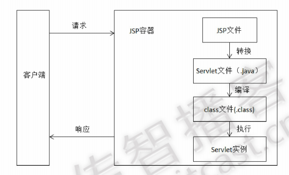

### 给初学者的建议

* 由于HTML+AJAX+服务器模式的流行，JSP目前在市场上用的越来越少了，但是还是有很多的老项目仍然在沿用它，而且作为JavaWeb程序员还是需要对曾经市场占有比重极高的JSP技术进行掌握的。
* 掌握JSP，最关键的是能明白它和HTML静态页面之间的区别，它和Servlet之间的联系，知道JSP页面里jstl或者el表达式解析的时机。熟悉JSP的九大内置对象。

### JSP运行原理

> JSP的工作模式是请求/响应模式,客户端首先发出HTTP请求，JSP程序手打哦请求后进行处理并返回处理结果。在一个JSP文件第一次被请求时，JSP引擎（容器）把该JSP文件转换成为一个Servlet，而这个引擎本身也是一个Servlet。



JSP的运行过程具体如下：

1. 客户端发出请求，请求访问JSP文件。

2. JSP容器先将JSP文件转换成一个Java源文件（Java Servlet源程序），在转换过程中，如果发现JSP文件中存在任何语法错误，则中断转换过程，并向服务端和客户端返回出错信息。

3. 如果转换成功，则JSP容器将生成的Java源文件编译成相应的字节码文件*.class。该class文件就是一个Servlet，Servlet容器会像处理其他Servlet一样来处理它。

   **注意：若是文件中存在JSTL或者EL表达式的话，那么在何时解析这些变量呢？答案是在将JSP文件解析成对应的Java源文件的时候就对JSTL或者EL表达式进行解析了，也就是说，当从服务器往浏览器写出页面内容时，JSTL或者EL中的变量就已经被解析成具体的值了。**

### 内置对象

| 名称          | 类型                                     | 描述                      |
| ----------- | -------------------------------------- | ----------------------- |
| out         | javax.servlet.jsp.JspWriter            | 用于页面输出                  |
| request     | javax.servlet.http.HttpServletReqeust  | 得到用户请求信息                |
| response    | javax.servlet.http.HttpServletResponse | 服气器向客户端的回应信息            |
| config      | javax.servlet.ServletConfig            | 服务器配置，可以取得初始化参数         |
| session     | javax.servlet.http.HttpSession         | 用来保存用户的信息               |
| application | jaax.servlet.ServletContext            | 所有用户的共享信息               |
| page        | java.lang.Object                       | 指当前页面转换后的Servlet类的实例    |
| exception   | java.lang.Throwable                    | 表示JSP页面所发生的异常，在错误页中才起作用 |
| pageContext | javax.servlet.jsp.PageContext          | JSP的页面容器                |

### EL表达式

> 一般的都是先将数据存储到Session,request,ServletContext等域对象中，再利用EL表达式来获取。

* 语法
  * 以"\${"符号开始，以"}"符号结束，具体格式：` ${表达式}` 。
* 获取数据
  * 类似page.findAttribute(); 先从page域中查找，没有找到去request域中查询，没找到去session域中找，没找到就去application域中找。
* 注意：1. 在用EL表达式获取数据时，必须保证该数据存在于四个域对象其中的一个。 2. 在获取数据时，一定不要忘记加\${}。

### JSTL表达式

* 使用时务必注意不要忘记导入JSTL的jar包：`jstl.jar` 和` standard.jar` 。
* 要使用taglib指令导入Core标签库：`<%@ taglib uri="http://java.sun.com/jsp/jstl/core" prefix="c" %>` 。

#### c:forEach标签

* 语法

```
<c:forEach [var="varName" items="collection" [varStatus="varStatusName"] [begin="begin"] [end="end"] [step="step"]>
	${varName}
</c:forEach>
```

* 参数解释

  * var属性用于指将当前迭代到的元素保存到page域中的名称
  * items属性用于指定将要迭代的集合对象
  * varStatus用于指定当前迭代状态信息的对象保存到page域中的名称
  * begin属性用于指定从集合中第几个元素开始迭代，begin的索引值从0开始，如果没有指定items属性，就从begin指定的值开始迭代，知道迭代结束为止
  * step属性用于指定迭代的步长，即迭代因子的增量

* 实例

  ```
  <c:forEach items="${userMap}" var="entry">
       ${entry.key}====${entry.value}
   </c:forEach>
  ```

* 注意：items里面需要使用到EL表达式的时候，一定不要忘记加\${}