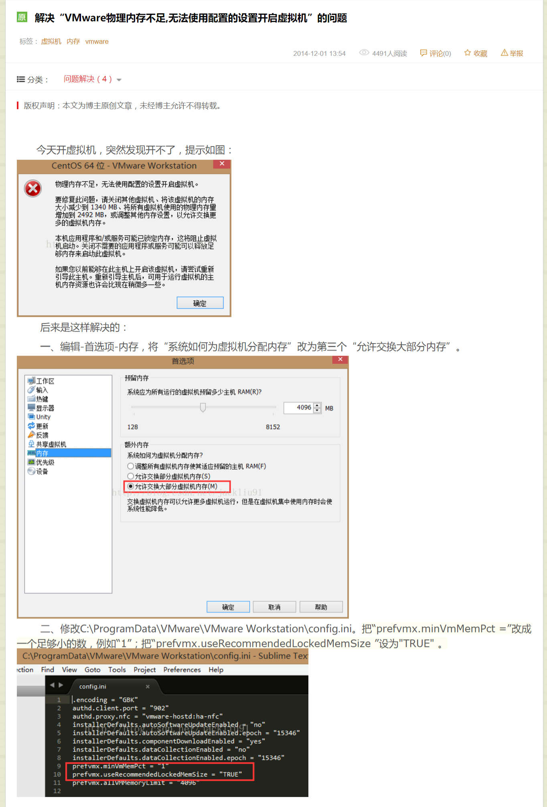

### 前言

* Linux以及redis这两个章节牵涉到的主要是软件的安装以及命令的操作，这些东西没必要再进行二次总结，若有遗忘的话直接回头复习讲师的Linux入门.pdf文档即可，特别是命令只有用的多了才能记的牢，初学者在学到这里的时候最容易出现的状况是安装软件出现异常，但是无法自己独立解决异常导致自己没办法接着向下学习，因此本文对异常状况做出了总结，希望对初学者有所帮助，另外本文主要解决的是CentOS6.5中出现的问题，对于CentOS7及其以上的版本有部分解决方案不适用。

### 异常状况

##### 网卡丢失：

* 异常描述：输入ifconfig，展示出的网络信息中没有IPV4的地址


* cd /etc/sysconfig/network-scripts/    vim ifcfg-eth0    然后修改onBOOT=yes    wq保存
* service network restart重启网络
* 若重启失败，或者重启后输入ifconfig仍然没有IP地址，那么先将当前系统挂起或关闭，然后点击VMware的编辑选项，选择虚拟网络编辑器，在弹出的窗口中点击还原默认设置(若此按钮为灰色只需先点击更改设置按钮即可)，确定还原
* 还原完毕后将虚拟机打开，再次输入service network restart重启网络
* 若仍然重启失败或重启后输入ifconfig还没有IP地址，那么打开电脑的网络和Internate设置(你自己的本机电脑，非虚拟机)，选择进入更改适配器选项，查看当前网卡中是否存在VMware Network Adapter Vmnet1以及VMware Network Adapter Vmnet8网卡，若存在，但是状态为禁用状态，右键改为启用状态，然后再进入虚拟机网络中重启网络即可。若适配器中不包含以上两个虚拟网卡，移步看**虚拟网卡无法创建** 一栏的解决方案。

##### ls命令找不到

* ```
  export PATH=/bin:/usr/bin:$PATH
  ```

#####虚拟网卡无法创建：

* 卸载VMware，然后再安装Ccleaner(网上下载即可)清注册表，重启电脑，然后安装VMware12。若还不行，再重启电脑，若还还不行，重装系统。

#####yum install gcc-c++失败

* 遇见这个问题请先确保电脑已联网，并且当前虚拟机网络模式为NAT模式


* vim /etc/resolv.conf

  ```
  ; generated by /sbin/dhclient-script
  search localdomain
  nameserver 192.168.84.2
  ```

  若该文件中没有上述内容，添加，若有则在该内容下再加一条：

  nameserver 8.8.8.8 然后Esc   wq保存再尝试安装gcc若还不行则将文本中的namerserver 192.169.84.2删掉，只保留nameserver 8.8.8.8保存再尝试安装

#####-bash: rpm:command not found

* 尝试/bin/rpm --version 能否获得RPM version 4.8.0的结果，若可以很可能是$PATH出了问题，执行 **ls命令找不到** 下面的解决方案  若不能获得该结果则尝试以下代码块：

  ```
  # execute all following commands as root, especially "cpio" at the end
  cd /
  wget http://centos.bio.lmu.de/6/os/x86_64/Packages/rpm-4.8.0-32.el6.x86_64.rpm
  rpm2cpio rpm-4.8.0-32.el6.x86_64.rpm | cpio -idmv
  ```

  ​

#####虚拟机物理内存不足，无法开启已挂起的系统

* 

#####该虚拟机似乎正在使用中 请获取所有权。

* 关掉VMware所有窗口，然后进入任务管理器中干掉VMware Tray Process进程，然后进入到存放此台Vmware虚拟机虚拟磁盘文件及配置文件存放的位置（也就是弹出提示窗口上的路径），找到后缀为.lck文件夹(有可能有一个，也有可能有两个)。将其全部删掉，再开启VMware即可。

#####内部错误。

* 很有可能是VM服务没有启动（可能是没有设置为开机自启或认为关闭），你可以进入 “服务”将VMAuthdService、VMnetDHCP、VMware NAT Service、VMwareHostd（VMware Workstation Server）、VMUSBArbService 这5个服务启动即可。

  进入服务方法：win+R都是运行，输入services.msc，win8是打开任务管理器，然后选择“服务”。

#####无法获得VMCI驱动程序的版本：句柄无效或者开启模块DevicePowerOn的操作失败。

* 关闭虚拟机，找到安装路径，用记事本打开.vmx结尾的文件
* 找到vmci0.persent = "TRUE"
* 把TRUE改为FALSE，保存，再次打开虚拟机，问题即可解决

#####虚拟机报错：VMware与Hyper-V不兼容。

* 进入控制面板
* 选择程序和功能
* 启用或关闭Windows功能
* 找到Hyper-V的选项
* 取消勾选，点击确定
* 重启电脑


#####Linux中MySQL乱码问题：

```
mysql解决中文乱码的完美配置方案：
1.在/etc/下新建my.cnf文件
2.在其中添加如下内容，注意：以下三项一项都不能少！不然会造成mysql重启失败！！！

[client]
default-character-set=utf8
[mysql]
default-character-set=utf8
[mysqld]
collation-server=utf8_unicode_ci
init-connect='SET NAMES utf8'
character-set-server=utf8

3.保存并退出。
4.重启mysql服务器  service mysql restart.
5.进入mysql,输入命令：SHOW VARIABLES LIKE 'char%';进行验证
6.若character_set_database的值为utf8,并且charcter_set_server的值也为utf8,恭喜你，中文乱码问题已解决！！
```
**注意：若在本机写好了一个web工程项目，想要将其发布到Linux中的tomcat中去运行，必须要保证电脑本机中的JDK版本与虚拟机中的JDK版本一致！！！ **