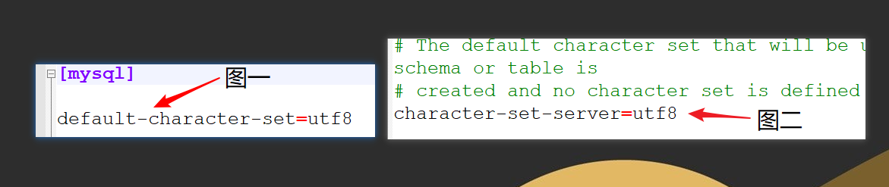

### 给初学者的建议

* 数据库的CRUD操作个人觉得，对于初学者来说学习MySQL这块新知识，除了需要反复记忆各类SQL语法、语句，还需要对MySQL安装后在my.ini文件中对于编码的设置有一定了解。在本章中逻辑查询处理部分我标的三颗星的原因是因为这块对于初学者来说来理解可能有些难,一下子不能那么的容易理解,但是真的把这个部分给理清楚了那么在写查询语句的时候对于每个关键字的作用及其位置心里都会比较有数了.
* MySQL本身语法基本就是英语语法,这块内容对于英语好的同学入门较快,英语差的需要多背相关单词,句子,而且MySQL若是一段时间不用,忘得极快,因此应时常复习,若是经常在网上找些相关的MySQL题目练习下的话巩固效果更佳,MySQL这块知识点面试的时候基本都是会问到的.
* 我将MySQL中的基本常用语句在本篇最下方整理成了一个表格,强烈建议初学者多背多记忆,之所以将这块整理成表格,就是为了便于初学者背诵相关MySQL语句来的,背的时候可以拿个遮挡物遮住表格的后两列,自己尝试着能不能根据中文提示独立写出相关语句.

##MySQL的SQL语句

###登录数据库★★★★★

方式一: mysql  -u root  -p  按回车后提示后输入密码

方式二:mysql -uroot -p自己的密码

完整格式:

 mysql -h主机地址 -u用户名 -p密码

连接本机: mysql -hlocalhost -uroot -p123456

注意:不写-hlocalhost代表默认访问本机数据库服务器

-u   username 用户名

-p  password密码

**注意，登录数据库时语句结尾不要加分号！！！**

### 逻辑查询处理★★★

> SQL语言不同于其他编程语言,最明显的不同体现在处理代码的顺序上,在大多数编程语言中,代码按顺序被处理.但在SQL语言中,第一个被处理的子句总是FROM子句.

如图一共有11个步骤,最先执行的是FROM操作,最后执行的是LIMIT操作.

1. FROM: 对FROM子句中的左表\<left_table>和右表\<right_table\>执行笛卡尔积,产生虚拟表VT1.
2. ON: 对虚拟表VT1应用ON筛选,只有那些符合 \<join_condition>的行才被插入虚拟表VT2中.
3. JOIN: 如果指定了OUTER JOIN(如LEFT OUTER JOIN,RIGHT OUTER JOIN),那么保留表中未匹配的行作为添加到虚拟表VT2中,产生虚拟表VT3.如果FROM子句包含两个以上表,则对上一个连接生成的结果表VT3和下一个表重复执行步骤1~步骤3,知道处理完所有的表为止.
4. WHERE: 对虚拟表VT3应用WHERE过滤条件,只有符合\<where_condition>的记录才被插入虚拟表VT4中.
5. GROUP BY: 根据GROUP BY 子句中的列,对VT4中记录进行分组操作,产生VT5.
6. CUBEE|ROLLUP:对表VT5进行CUBE或ROLLUP操作,产生表VT6. **注意:这里了解即可.**
7. HAVING:对虚拟表VT6应用HAVING过滤器,只有符合\<having_condition>的记录才被插入虚拟表VT7中.
8. SELECT:第二次执行SELECT操作,选择指定的列,插入到虚拟表VT8中.
9. DISTINCT: 去除重复数据,产生虚拟表VT9.
10. ORDER BY: 将虚拟表VT9中的记录按照\<order_by_list>进行排序操作,产生虚拟表VT10.
11. LIMIT:取出指定行的记录,产生虚拟表VT11,并返回给查询用户.

### 事务

#### 事务的特性:ACID

* 原子性(Atomicity)  原子性是指事务是一个不可分割的工作单位,事务中的操作要么都发生,要么都不发生.
* 一致性(Consistency)  事务前后数据的完整性必须保持一致.
* 隔离性(Isolation)  事务的隔离性是指多个用户并发访问数据库时,一个用户的事务不能被其它用户的事务所干扰,多个并发事务之间数据要相互隔离.
* 持久性(Durability)  持久性是指一个事务一旦被提交,它多数据库中数据的改变就是永久性的,接下来即使数据库发生故障也不应该对其有任何影响.

#### 事务的隔离级别

* read uncommitted 读未提交,一个事务读到另一个事务没有提交的数据.
  * 存在:3个问题(脏读,不可重复读,虚读)
  * 解决:0个问题
* read committed 读已提交,一个事务读到另一个事务已经提交的数据
  * 存在:2个问题(不可重复读,虚读)
  * 解决:1个问题(脏读)
* repeatable read  可重复读,在一个事务总读到的数据始终保持一致,无论另一个事务是否提交.
  * 存在: 1个问题(虚读)
  * 解决:2个问题(脏读,不可重复读)
* serializable  串行化,同时只能执行一个事务,相当于事务中的单线程.
  * 存在:0个问题
  * 解决:3个问题(脏读,不可重复读,虚读)
* 常见数据库的默认隔离级别
  * MySQL:repeatable read
  * Oracle: read commited

### 其他

* 编码与my.ini之间的关系

  

  my.ini中分别对MySQL服务器端及MySQL客户端编码进行了指定,如图一,对MySQL客户端编码指定为utf8编码,如图二,对MySQL服务器端的编码指定为utf8,若是从客户端传来的数据是按照指定编码发送的,就不会出现乱码,但是,由于Windows系统默认编码为GBK,因此通过黑窗口打开的MySQL的客户端编码也为GBK,但是MySQL配置文件指明客户端编码为utf8,这时就会因为MySQL客户端实际编码与指定编码不一致造成解析数据乱码问题,另外,若是给服务器或者客户端指定编码方式为latian1编码方式的话,会造成输入的中文全部以"?"表示,这种状况是因为latian1编码本身就不包含中文字符造成的.

* MySQL卸载时

  * 在客户端中卸载MySQL
  * 将C:\ProgramData\MySQL文件夹删除,注意,ProgramData默认隐藏文件夹,若是在C盘下没发现,需要勾选上隐藏的项目后即可看到该文件夹.

### SQL语句一览表★★★★★

> :star2:个数，一个代表了解，三个代表熟悉，五个代表必须掌握，建议根据星级选择背诵相关SQL语句，背诵的时候建议根据中文作用先尝试自己写SQL语句，然后再看SQL语句的写法

| 所属         | 作用             | 星级                                  | SQL                                      | 举例                                       |
| ---------- | -------------- | ----------------------------------- | ---------------------------------------- | ---------------------------------------- |
| 数据库的CRUD操作 | 创建数据库          | :star2::star2::star2::star2::star2: | `create database 数据库的名字;`                | `create database day8;`                  |
|            | 创建数据库          | :star2:                             | `create database 数据库的名字 character set 字符集;` | `create database day08_2 character set gbk;` |
|            | 创建数据库          | :star2:                             | `create database 数据库的名字 character set 字符集 collate 校对规则;` | `create database day08_3 character set utf8 collate utf8_bin;` |
|            | 查看某个数据库的定义语句   | :star2::star2::star2:               | `show create database 数据库的名字;`           | `show create database day8;`             |
|            | 查看所有数据库        | :star2::star2::star2:               | `show databases;`                        | `show databases;`                        |
|            | 修改数据的字符集       | :star2:                             | `alter database 数据库的名字  character set 字符集;` | `alter database day8 character set utf8;` |
|            | 删除数据库          | :star2::star2::star2::star2::star2: | `drop database 数据库名字;`                   | `drop database day8;`                    |
|            | 查看当前正在使用的数据库名称 | :star2::star2::star2:               | `select database();`                     | `select database();`                     |
|            | 切换数据库(选中数据库)   | :star2::star2::star2:               | `use 数据库名字;`                             | `use day8;`                              |
| 表的CRUD操作   | 创建表            | :star2::star2::star2::star2::star2: | `create table 表名(列名1 列的类型 [列的约束],列名2 列的类型 [列的约束])` | `create table employee(eid int primary key auto_increment,ename varchar(20) unique,sal double,deptno int not null);` |
|            | 查看所有表          | :star2::star2::star2:               | `show tables;`                           | `show tables;`                           |
|            | 查看表的创建过程,建表语句  | :star2::star2::star2:               | ` show create table 表名`                  | ` show create table employee`            |
|            | 查看表结构          | :star2::star2::star2:               | `desc 表名;`                               | `desc employee;`                         |
|            | 添加列(add)       | :star2::star2::star2:               | ` alter table 表名 add 列名 列名类型`            | ` alter table employee add gender varchar(2);` |
|            | 修改列(modify)    | :star2::star2::star2:               | ` alter table 表名 modify 列名 列的类型`         | ` alter table employee modify gender varchar(4);` |
|            | 修改列名(change)   | :star2::star2::star2:               | ` alter table 表名 change 旧的列名 新列名 列的类型`   | ` alter table employee change gender sex varchar(4);` |
|            | 删除列(drop)      | :star2::star2::star2:               | ` alter table 表名 drop 列名;`               | ` alter table employee drop sex;`        |
|            | 修改表名(rename)   | :star2::star2::star2:               | ` rename table 旧表名 to 新表名`               | ` rename table employee to emp;`         |
|            | 修改表的字符集        | :star2::star2::star2:               | ` alter table 表名 character set 字符集`      | ` alter table emp character set 'utf8';` |
|            | 删除表            | :star2::star2::star2:               | ` drop table 表名`                         | ` drop table emp;`                       |
| 表数据的CRUD操作 | 插入数据(方式一)      | :star2::star2::star2::star2::star2: | ` insert into 表名(字段名1,字段名2) values(值1,值2);`**(列名和值必须一一对应)** | ` insert into stu(sname,gender) values('zs','ma');` |
|            | 插入数据(方式二)      | :star2::star2::star2::star2::star2: | ` insert into 表名 values(值1,值2,值3)` **(注意:如果不写列名,那么在插入数据的时候,要根据表的所有字段一一对应插入)** | ` insert into stu values(3,'ww','nv');`  |
|            | 删除(方式一)        | :star2::star2::star2::star2::star2: | ` delete from 表名 [ where 条件 ]`           | ` delete from stu where stuno=1;`        |
|            | 删除(方式二)        | :star2::star2::star2:               | truncate 表                               | ` truncate stu;`                         |
|            | 更新表记录          | :star2::star2::star2::star2::star2: | ` update 表名 set 列名=列的值,列名2=列的值2  [where 条件]` | ` update stu set isDelete=1 where stuno=6;` |
|            | 简单查询           | :star2::star2::star2::star2::star2: | ` select 列名,列名... from 表名`               | ` select * from product;`                |
|            | 别名查询           | :star2::star2::star2::star2::star2: | ` 表名 as 别名 或者 列名 as 别名 其中as均可以用空格来代替 `   | ` select p.pname 商品名称,p.price 价格 from product as p;` |
|            | 去重复值           | :star2::star2::star2::star2::star2: | ` distinct 列名,列名...`                     | `select distinct pname,price,pdesc,cno from product;` **注意:多列去除重复的, 必须是每一列都一样才算重复** |
|            | 条件查询           | :star2::star2::star2::star2::star2: | `select [distinct][列名,列名] [*] from 表名  [where 条件]` | \> \>= \< \<= != <\>   and or not   is null   is not null   in  between..and..   like %(匹配多个字符)    \_(匹配单个字符) |
|            | 排序查询           | :star2::star2::star2::star2::star2: | ` select [distinct][列名,列名] [*] from 表名  where 列名 条件 order by 列名 asc(升序)/desc(降序);` | `select * from product order by price desc;` |
|            | 聚合函数查询         | :star2::star2::star2::star2::star2: | `sum() 求和;avg() 求平均值; count()统计个数;max() 最大值;min() 最小值 ` | ` select sum(price) from product;`**注意:where条件后面不能接聚合函数 having后面可以加** |
|            | 分组查询           | :star2::star2::star2::star2::star2: | ` select 分组的条件,分组之后的操作 from 表名  group by 分组条件 having 条件过滤;` | ` select cno 类别,avg(price) 平均价格 from product group by cno having avg(price) > 60;` |
| 多表查询       | 显式内连接查询        | :star2::star2::star2:               | `select 查询字段 from 表 1 inner join 表2 on 表1.关系字段 = 表2.关系字段;` **inner 可以省略不写** | ` SELECT * FROM USER INNER JOIN orders ON user.userid = orders.uno WHERE user.userid = 1;` |
|            | 隐式内连接查询        | :star2::star2::star2::star2::star2: | `select 查询字段 from 表 1,表2 where 表1.关系字段 = 表2.关系字段;` | ` SELECT * FROM USER,orders WHERE user.userid = orders.uno;` |
|            | 外连接查询          | :star2::star2::star2::star2::star2: | ` select 所查字段 from 表 1 left|right [outer] join 表2 on 表1.关系字段 = 表2.关系字段 where 条件;` | ` SELECT * FROM USER LEFT OUTER JOIN orders ON user.userid = orders.uno;` |
|            | 分页查询           | :star2::star2::star2::star2::star2: | ` select 所查字段 from 表 limit 起始索引,查询几条;`   | ` select * from product limit 0,3;`      |

