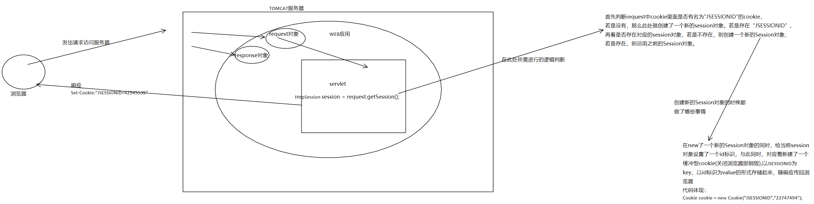

### 什么是会话★★★★★

* 明确会话的含义:用户打开一个浏览器访问页面,访问网站的很多页面,访问完成后将浏览器全都关闭的过程称为是一次会话.**千万不要将会话等价于session,会话技术中包括cookie和session两项技术是依赖于两者的.  一般情况下,浏览器打开,访问服务器后 关闭浏览器就是一次会话.**
* 会话就是用来保护用户各自的数据的!有会话的时候不一定存在session对象，毕竟只有调用request.getSession()方法的时候才会创建session对象，并在此时往客户端写回名为JSESSIONID的cookie。

### 常用方法★★★★★

* Object getAttribute(String name)
  * 返回与给定name匹配的对应的对象，如果没有对象与这个name绑定就返回null
* Enumeration getAttributeNames()
  * 返回绑定在当前session下的所有对象所对应的名字的字符串数组的枚举
* void setAttribute(String name,Object value)
  * 用特定的名字将一个对象绑定到当前的session中。
* void removeAttribute(String name)
  * 从session中移除给定的name绑定的对象。
* void setMaxInactionveInterval(int interval)
  * 在客户端一直未访问session的情况下，指定session对象的存活时间，单位为秒。

### 执行原理★★★

* Session的执行原理：当程序需要为某个客户端的请求创建一个session的时候,服务器首先检查这个客户端的请求里是否已包含了一个session标识-称为session id(JSESSIONID),如果已包含一个session id则说明以前已经为此客户端创建过session,服务器就按照session
  id 把这个session检索出来使用(如果检索不到,可能会新建一个),如果客户端请求不包含session id,则为此客户端创建一个session并且生成一个于此session相关联的session
  id,session id的值应该是一个既不重复,又不容易被找到规律以仿造的字符串,这个session id将被在本次响应汇总返回给客户端保存.

* 两种Session对象释放的情景:

  * 情景一:浏览器关闭清除JSESSIONID再次打开并发送请求后虽然服务器端session对象仍然存在,但是由于服务器是先去获取JSESSIONID然后在服务器中匹配对应的session对象的,因此会找不到该session,进而再次创建了一个新的session对象并自动生成一个新的JSESSIONID通过响应写回到浏览器中.服务器先前的那个session对象到时间后就会自动删除.

  * 情景二:浏览器一直开着,但是距离session的最后一次使用已经过了30分钟后就会删除服务器端的session对象.

> 思考：session对象的默认时间为半个小时，浏览器关闭再打开就会重新开启了一个会话，之前session中存储的东西就找不到了，那么可不可以通过一些设置去实现session的默认存在时间为一天，浏览器关闭再打开的时候还可以获取原来的那个session对象呢？如果可以，应该怎么做呢？？

### session生命周期流程图★★★

请放大观看此图

> 思考题答案：可以通过手动更改key为JSESSIONID的cookie的时长进而持久化Cookie，手动更改Session的过期时间延长Session对象的存活时间，进而做到按照自己的意愿设置Session对象的总时长。而且在同一个web应用中若是能获取到JSESSIONID对应的值，那么就可以在其他的客户端上获取到其对应Session对象，但是在同一个服务器下的多个Web应用之间是做不到这点的，也就是说Session对象与Web应用绑定