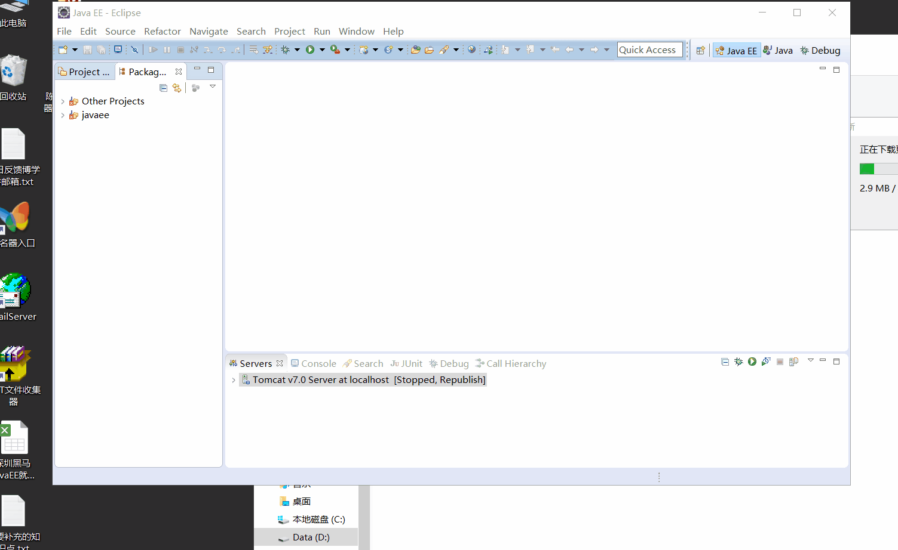
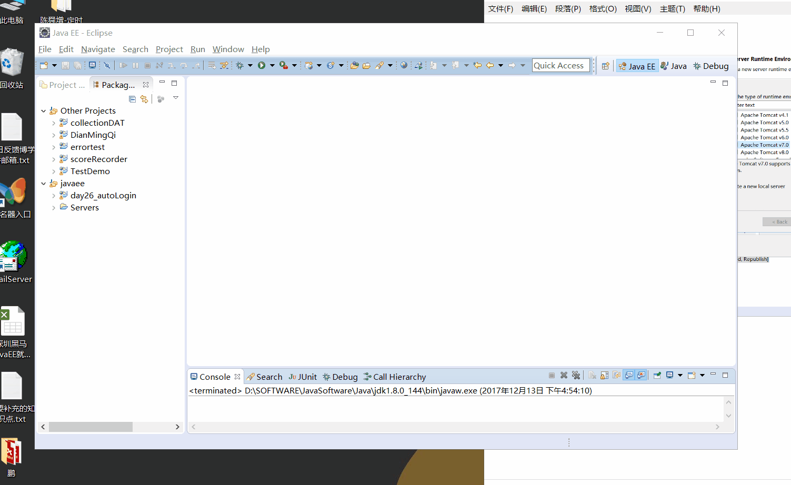
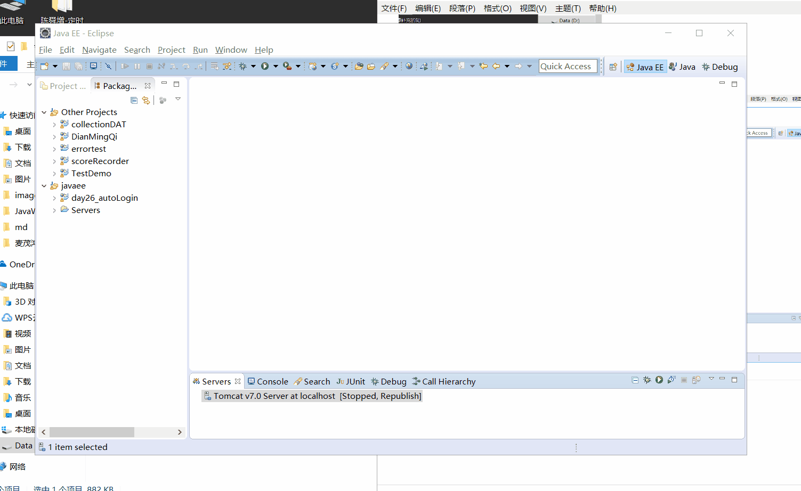
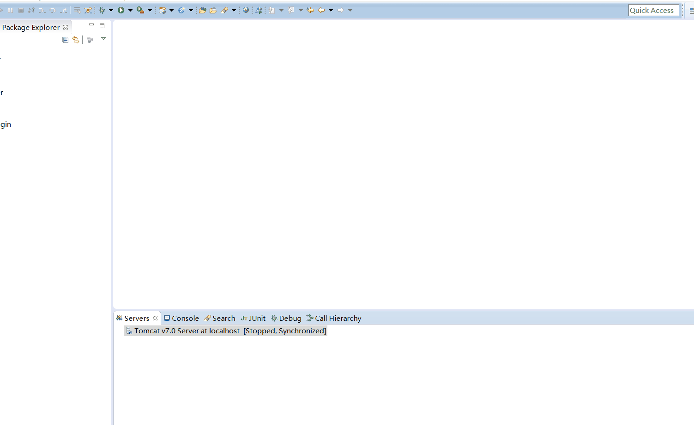
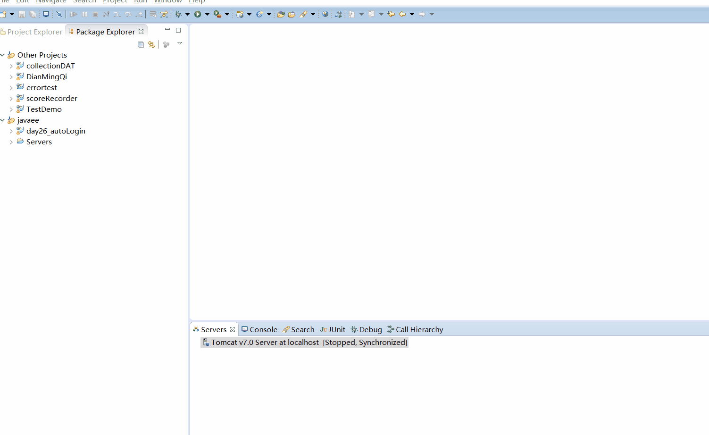

### Tomcat的安装

> Tomcat的安装包是一个压缩包，从官网下载下来后解压即可使用，卸载的话只需删除解压文件即可

1. 从Tomcat官网下载它的压缩包，下载地址：http://mirrors.shuosc.org/apache/tomcat/tomcat-7/v7.0.82/bin/apache-tomcat-7.0.82.zip

2. 将其解压到指定位置

3. 检查电脑是否配置好JDK环境变量

4. JDK环境变量若没配置，按gif动图的演示进行配置并验证配置是否成功

   

5. 进入tomcat解压后的文件夹下，进入bin文件夹，双击startup.bat,若效果为如下示例，证明tomcat安装并配置成功

   

### Tomcat与eclipse的整合

### Tomcat在eclipse中的使用

1. 创建Tomcat服务器

   

2. 创建后双击对服务器进行配置，首先是端口的配置方式，如下(假如你需要对端口进行设置的话，需要按照下图演示的方式进行设置，不过一般的都是默认端口号的)

   

3. 配置中还需要配置一项，就是指定tomcat的配置文件，tomcat和其他应用程序不同，它可以复制出一份配置文件，然后单独的用这套配置文件运行一个tomcat程序，当然了，当运行的时候需要在配置文件中将端口号修改一下，不然的话同时运行多个tomcat就会造成端口被占用的问题。下面演示tomcat的三种配置方式

   1. 按照eclipse的默认配置去运行web应用。(目录较深，识别度低，不易于维护，不推荐)

      

   2. 指定为tomcat本身的配置文件及其本身的web应用发布的地方(采用这种方式的话在一个tomcat应用只能对应一个实例了，不是很推荐)

      

   3. 自己自定义根据tomcat复制出的配置文件所在位置，这样子就可以根据一个tomcat分配出几种不同的配置方案，而且可以同时启动这些tomcat应用。